# Breakthrough

<p align="center">
  <a href="https://www.rust-lang.org"></a>
  <a href="https://macroquad.rs/"></a>
  <a href="https://github.com/clap-rs/clap"></a>
  <a href="https://pandas.pydata.org"></a>
  <a href="LICENSE"></a>
</p>

A high-performance implementation of the **Breakthrough** board game featuring advanced AI agents based on **Monte Carlo Tree Search (MCTS)** and **Minimax**. This project explores various MCTS modifications, including **RAVE** (*Rapid Action Value Estimation*) and **Heavy Playouts**, evaluating their performance against heuristic-based baselines.

## Game Rules

Breakthrough is a two-player abstract strategy game played on a rectangular board (most commonly 8×8).
- **Objective**: Be the first to reach the opponent's back row with any piece, or capture all opponent pieces.
- **Movement**: Pieces move one square forward (straight or diagonally) into empty squares.
- **Capture**: Captured by moving one square diagonally forward onto an opponent's piece.
- **No Draws**: The game's forward-only nature ensures a decisive outcome.

## Key Features

- **Advanced Search Algorithms**:
  - **MCTS (UCT)**: Standard Monte Carlo Tree Search using the UCB1 formula.
  - **RAVE**: Accelerated convergence using the AMAF (*All-Moves-As-First*) heuristic.
  - **Heavy Playouts**: Domain-aware simulations using $\epsilon$-greedy heuristic guidance.
  - **Minimax**: Tactical baseline with Alpha-Beta pruning and expert evaluation.
- **Interactive GUI**: Real-time gameplay with a built-in parameter adjustment panel.
- **Tournament Mode**: Automated head-to-head evaluation of different agent configurations.
- **Reproducibility**: Deterministic seeding for all probabilistic components.

## Graphical Interface

| Main Menu | Human Gameplay |
|:---:|:---:|
| 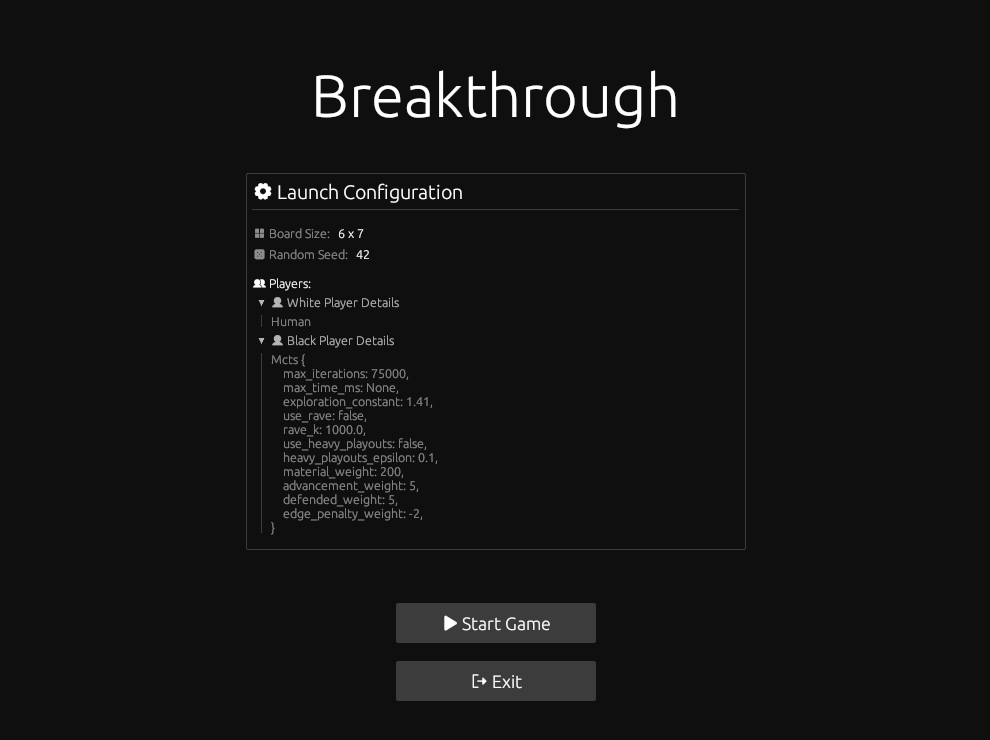 | 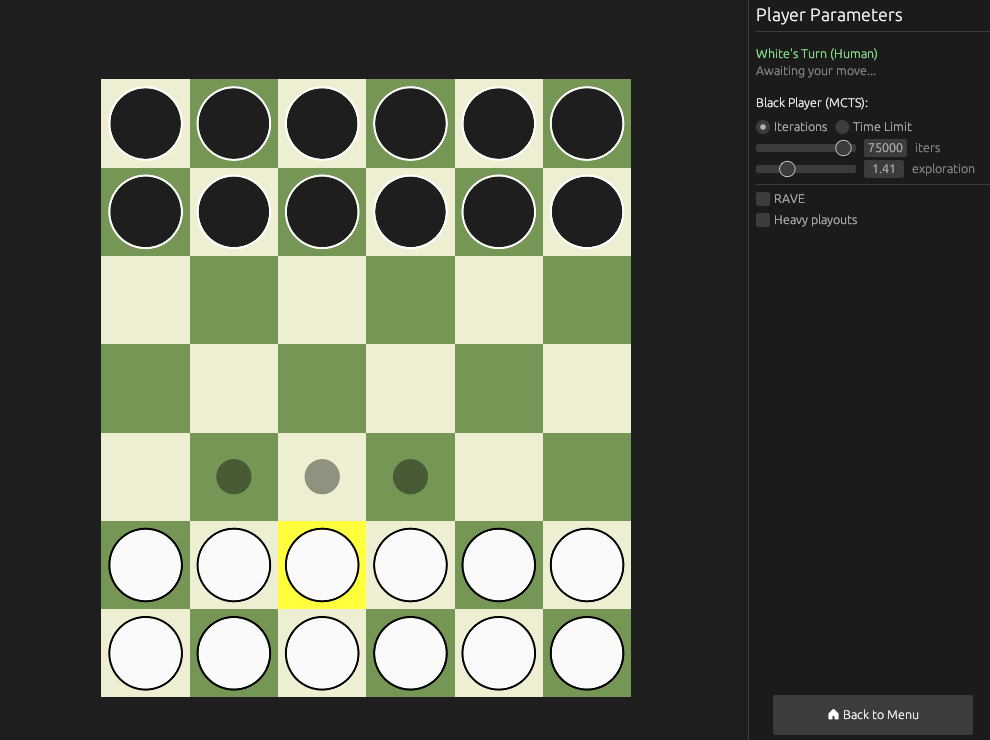 |
| **MCTS Agent Thinking** | **Victory Screen** |
| 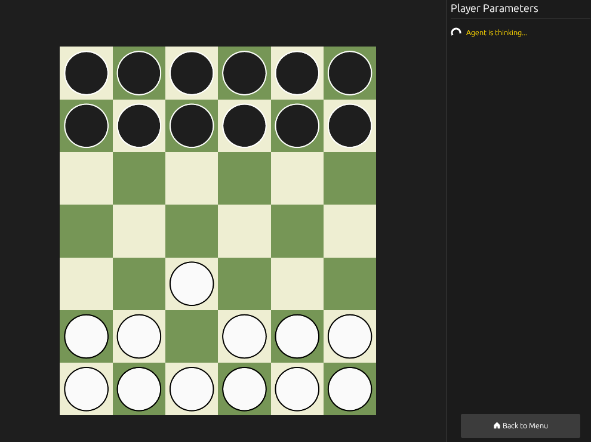 | 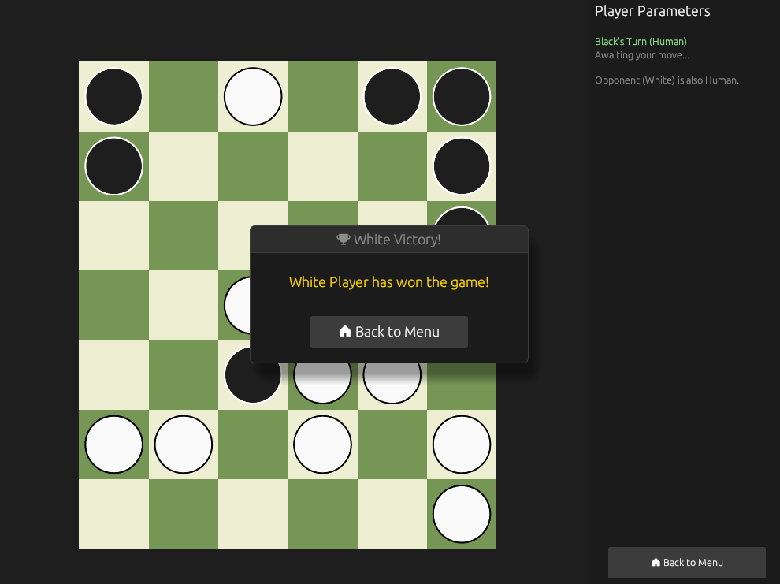 |

## Evaluation

The performance of various MCTS configurations was evaluated against a **Minimax baseline** with varying search depths ($d \in [1, 7]$).

### Win Rates

The charts below compare the win rates of different MCTS variants against Minimax of increasing strength. Notably, MCTS variants dominate at $d=1$, struggle in the middle range ($d=3, 4$), but regain efficiency at larger depths ($d=7$) due to the long-term strategic value of full simulations.

| MCTS | MCTS + RAVE | MCTS + Heavy Playouts |
|:---:|:---:|:---:|
| 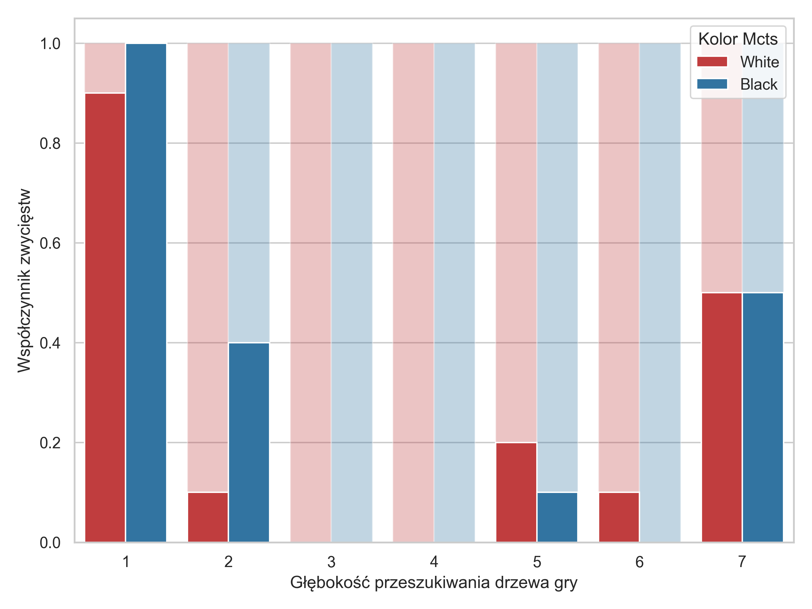 | 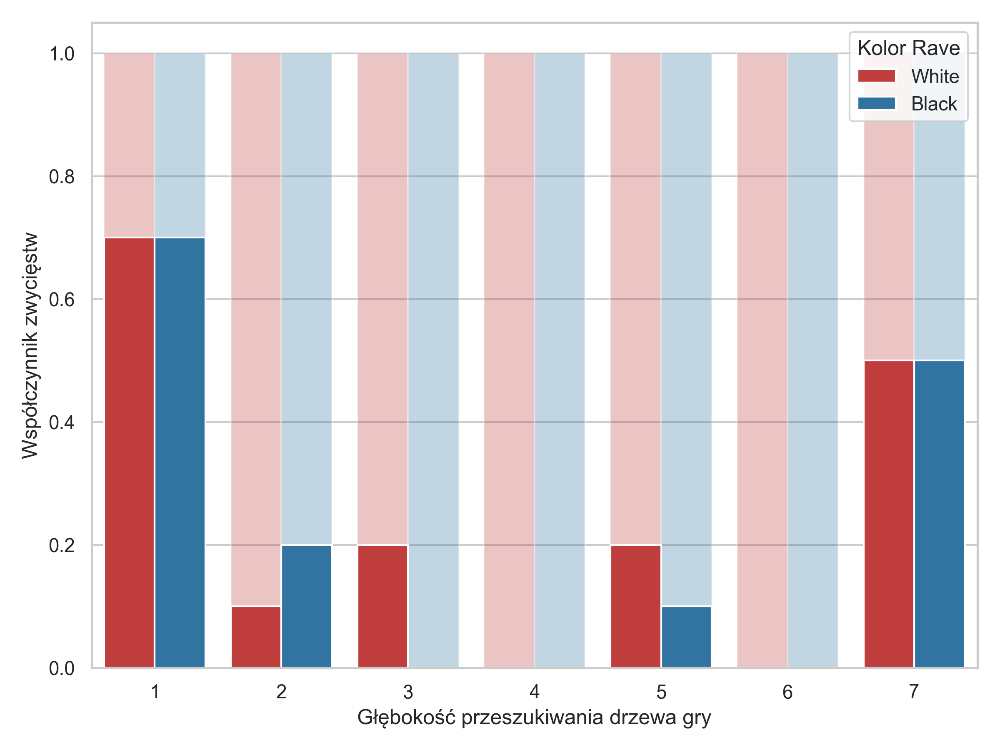 | 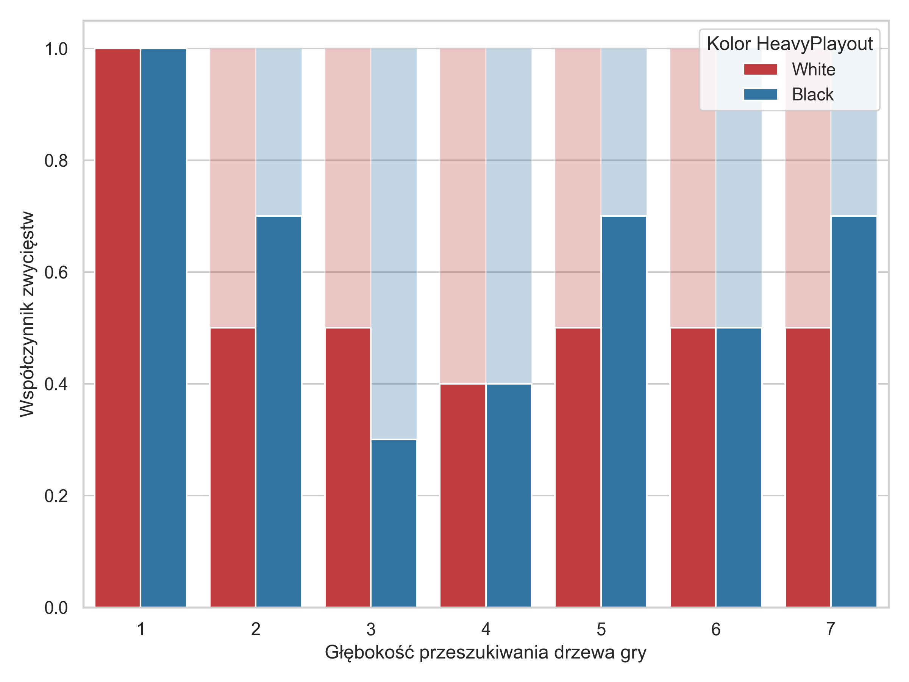 |

### Thinking Time

Thinking times reflect the computational overhead of each modification. While RAVE adds minimal cost, **Heavy Playouts** significantly increase the average move time due to domain-specific heuristic evaluations during every simulation step.

| MCTS | MCTS + RAVE | MCTS + Heavy Playouts |
|:---:|:---:|:---:|
| 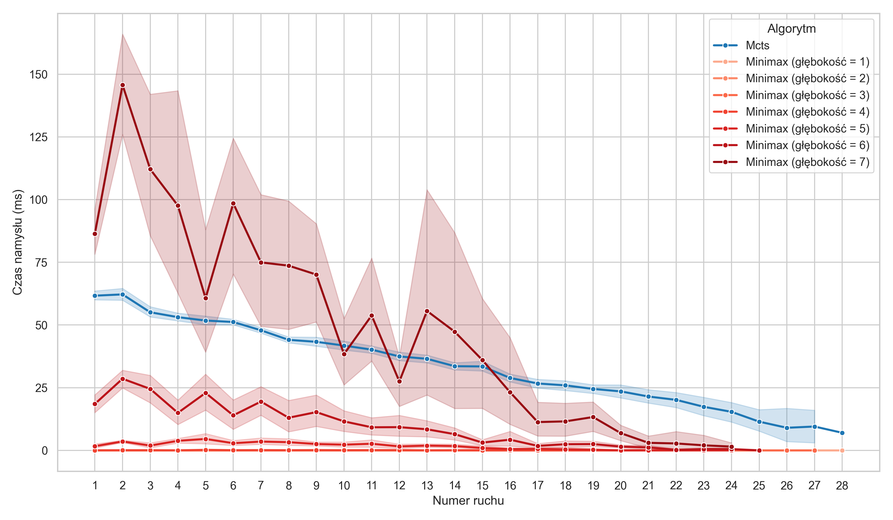 | 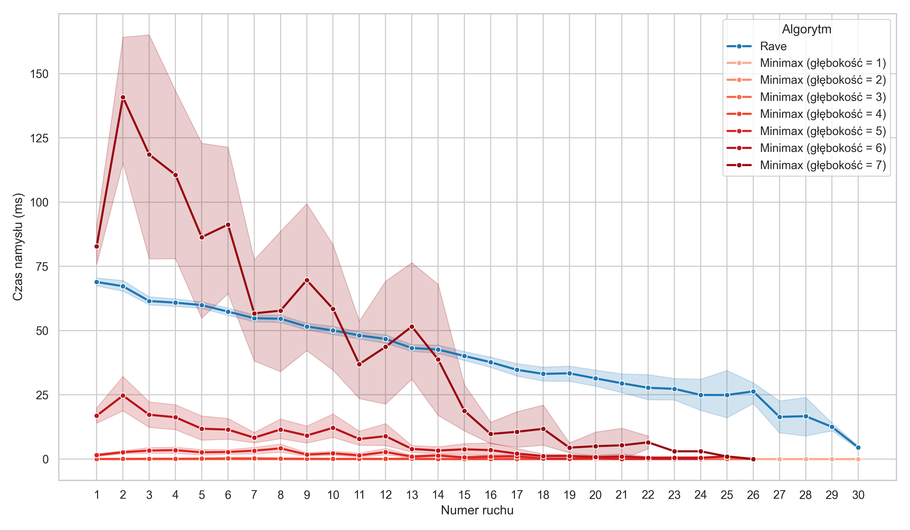 | 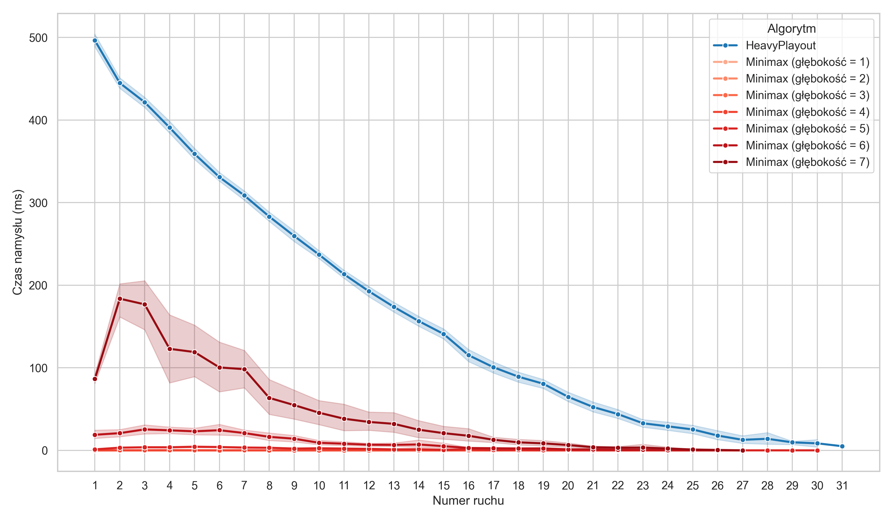 |

### Game Length Distribution
The total number of moves per game indicates the aggressiveness and tactical depth of the agents. Boxplots illustrate the distribution of game lengths across different experiments.

| MCTS | MCTS + RAVE | MCTS + Heavy Playouts |
|:---:|:---:|:---:|
| 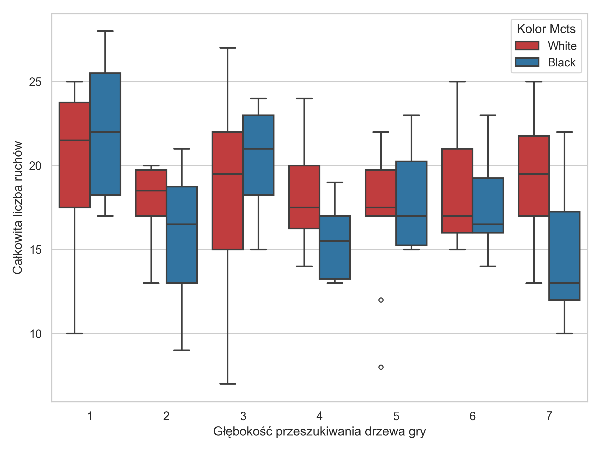 | 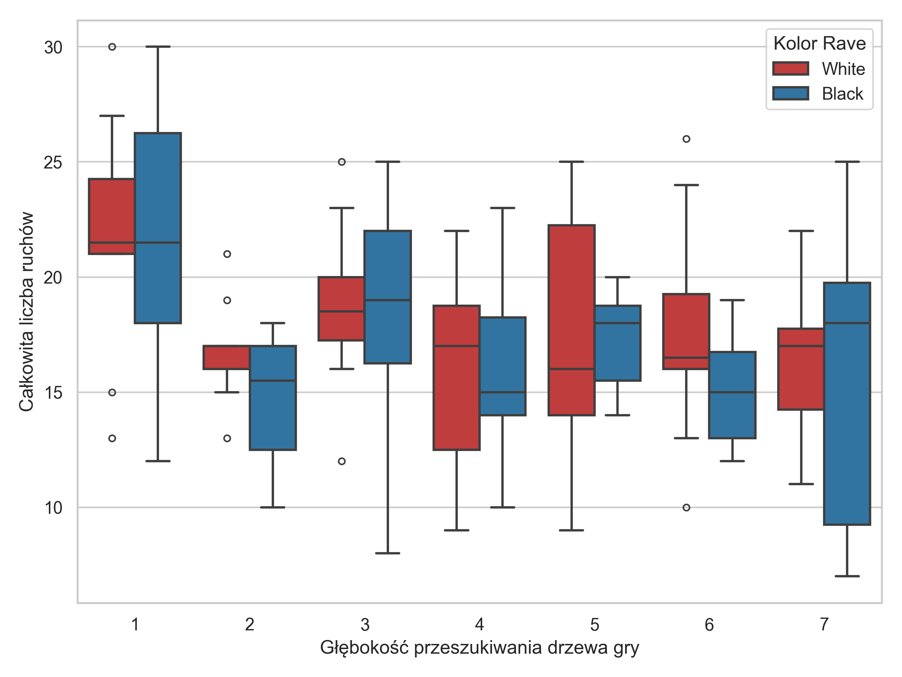 | 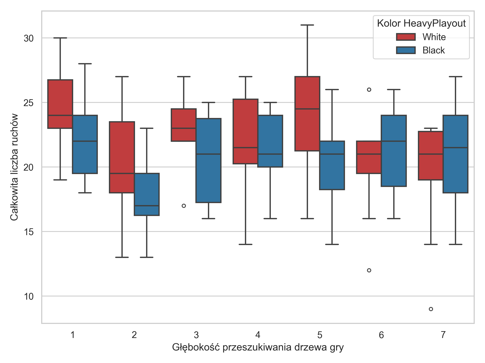 |

## User Manual

### Build Process

The computational layer and graphical interface of the project are implemented entirely in **Rust**. To build and run the executables, you must have the **Rust toolchain** installed.

Verify your installation by checking the versions of `rustc` and `cargo`:

```bash
rustc --version
cargo --version
```

To build the application in **release mode** (optimized), run the following command from the project root:

```bash
cd src/compute && cargo build --release
```

After a successful compilation, two independent executables will be generated in the `src/compute/target/release` directory: `breakthrough` and `tournament`. Both support command-line arguments (CLI). You can access the built-in help system by adding the `-h` or `--help` flag:

```bash
./breakthrough --help
```

### Graphical Environment
The `breakthrough.exe` executable launches a graphical testing environment for single games between humans or a human and an AI agent. It allows defining board dimensions, setting random seeds, and saving detailed game logs for each player.

**Usage:**
```bash
./breakthrough [OPTIONS] <CONFIG>
```

| Option / Argument | Description |
|:--- |:--- |
| `<CONFIG>` | Path to the TOML configuration file. Optional (default: `config.toml`). |
| `--white-output <PATH>` | (Optional) Path to the JSONL output file for the white player. Default: `white_output.jsonl`. |
| `--black-output <PATH>` | (Optional) Path to the JSONL output file for the black player. Default: `black_output.jsonl`. |
| `--board-width <INT>` | (Required) Board width (number of columns). |
| `--board-height <INT>` | (Required) Board height (number of rows). |
| `--seed <INT>` | (Optional) Seed for the random number generator, crucial for reproducibility. |
| `-h, --help` | Displays the help screen with all available parameters. |
| `-V, --version` | Displays the program version. |

### Tournament Environment
The `tournament.exe` executable allows running games between two AI agents. The CLI is consistent with the graphical environment.

**Usage:**
```bash
./tournament [OPTIONS] <CONFIG>
```

### Input File Format

Agent parameters are configured using a TOML text file. You can define independent settings for both sides (white and black). Each player must have a specified `type`, which determines the available optional parameters. If a field is omitted, predefined defaults are used.

**Example:**
```toml
board_width = 6
board_height = 7
seed = 100

[white_player]
type = "Minimax"
max_depth = 5
material_weight = 250
advancement_weight = 10

[black_player]
type = "Mcts"
max_iterations = 100000
exploration_constant = 1.41
use_heavy_playouts = true
```

#### Configuration Details

**Minimax Agent**
| Field | Default | Description |
|:--- |:--- |:--- |
| `max_depth` | `4` | Maximum search depth in the game tree. |
| `material_weight` | `200` | Weight for material advantage (number of pieces). |
| `advancement_weight` | `5` | Weight for piece advancement toward the opponent's back row. |
| `defended_weight` | `5` | Weight for safe positions where pieces defend each other. |
| `edge_penalty_weight`| `-2` | Penalty for placing pieces on the edges of the board. |

**MCTS Agent**
| Field | Default | Description |
|:--- |:--- |:--- |
| `max_iterations` | `75000` | Maximum MCTS iterations (tree expansions). |
| `max_time_ms` | `None` | Optional hard time limit per move in milliseconds. Overrides iterations if set. |
| `exploration_constant`| `1.41` | Exploration constant ($C$) in the UCT formula. |
| `use_rave` | `false` | Boolean to activate the RAVE modification. |
| `rave_k` | `1000.0` | Parameter $k$ controlling RAVE heuristic weight. |
| `use_heavy_playouts` | `false` | Boolean to enable heuristic-guided rollout simulations. |
| `heavy_playouts_epsilon`| `0.1` | Probability of a random move ($\varepsilon$) in $\epsilon$-greedy heavy playouts. |
| `material_weight` | `200` | Material advantage weight for heavy playouts evaluation. |
| `advancement_weight` | `5` | Advancement weight for heavy playouts. |

**Human Player**

Used for manual testing. Set `type = "Human"`. No additional parameters required.

### Output File Format

Results are saved in JSONL (JSON Lines) files. Each line is a valid JSON object aggregating statistics from a single player's perspective.

**Common Output Fields:**

| Field | Description |
|---|---|
| `board_width` | Board width dimension. |
| `board_height` | Board height dimension. |
| `seed` | Random seed used for the game. |
| `agent_type` | Type of the agent (`Minimax`, `Mcts`, or `Human`). |
| `agent_color` | Assigned color (`White` or `Black`). |
| `agent_won` | Boolean flag indicating if the agent won. |
| `pieces_remaining` | Number of the agent's pieces at the end of the game. |
| `total_moves` | Total number of moves made by the agent. |
| `moves` | List of moves performed during the game (e.g. "a6a5").|
| `move_times_ms` | List of thinking times for each move. |
| `opponent_type` | Type of the opponent agent. |
| `opponent_pieces_remaining` | Number of opponent’s pieces remaining at the end of the game. |

**Algorithm-Specific Fields:**

**Minimax:**

| Field | Description |
|---|---|
| `max_depth` | Maximum depth of the search tree. |
| `total_nodes_evaluated` | Total number of nodes evaluated during search. |
| `total_cutoffs` | Number of alpha-beta pruning cutoffs. |

**MCTS:** 

| Field | Description |
|---|---|
| `max_iterations` | Maximum number of iterations allowed. |
| `exploration_constant` | Constant controlling the exploration vs exploitation balance. |
| `use_rave` | Whether the RAVE heuristic is enabled. |
| `use_heavy_playouts` | Whether full (heavy) playout simulations are used. |
| `total_iterations` | Actual number of iterations performed. |
| `total_nodes_created` | Number of nodes created in the search tree. |

## Authors

The project was implemented as part of the *Methods of Artificial Intelligence* academic course in the summer semester of the 2025–2026 academic year by:
- [Adam Grącikowski](https://github.com/adamgracikowski)
- [Piotr Iśtok](https://github.com/p10tr13)

## License
This project is licensed under the MIT License - see the [LICENSE](LICENSE) file for details.
